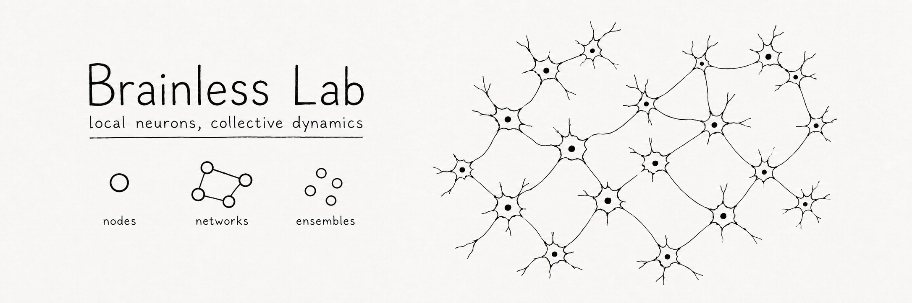

# BrainlessLab.jl

<p align="center"></p>

<p align="center">
  <em>Behaviour from collectives of simple neuron-like nodes.</em><br>
  <a href="https://brainless-lab.pages.dev/core/getting-started/"><strong>Core handbook</strong></a>
  &middot;
  <a href="https://brainless-lab.pages.dev/experimental/">Experimental catalog</a>
  &middot;
  <a href="https://disi.org">Diverse Intelligences Summer Institute 2026</a>
</p>

BrainlessLab is an extensible Julia lab for neural reservoirs in closed sensorimotor
loops. It provides tasks, generic embodiment, single-agent and population worlds,
recording, analysis, batch tools, and evidence-aware experiment workflows.

The canonical baseline is `node=:falandays`: an authors-faithful implementation of the
tested Falandays homeostatic spiking reservoir. It adapts neural activity online and has no
trained readout. Other reservoirs, embodiment components, physical worlds, analyses, and
studies are experimental unless their documentation states a narrower validated boundary.

## Quickstart

Install Julia, clone the repository, and use the pinned project:

```bash
git clone https://github.com/btgaskin/brainless-lab.git
cd brainless-lab
julia --project=. -e 'using Pkg; Pkg.instantiate()'
```

Run the canonical reservoir on tracking:

```bash
julia --project=. -e 'using BrainlessLab; sim = simulate(:tracking; node=:falandays, ticks=1000, seed=11); println(task_outcome(sim))'
```

`task_outcome(sim)` returns the task-declared outcome key, raw value, and value normalized
between that task's anchors. It returns `nothing` for a task with no scalar objective.
Scores are task-specific. Do not compare a tracking score directly with a Pong or forage
score.

Continue with:

1. [Getting started](https://brainless-lab.pages.dev/core/getting-started/)
2. [Core task tour](https://brainless-lab.pages.dev/core/task-tour/)
3. [Architecture](https://brainless-lab.pages.dev/core/architecture/)
4. [Design a study](https://brainless-lab.pages.dev/core/design-study/)

## Core composition

```text
NodeModel → Reservoir → AbstractBody → Agent → Ensemble{Environment}
                                                    ↓
                                                  Task
                                                    ↓
                                             Runner → Run
                                                    ↘
                                                   Recorder
```

`AbstractBody` is the public body boundary. `Embodiment` is the generic concrete
composition of geometry, sensors, encoders, readouts, actuators, dynamics, optional physiology,
stable ports, and runtime state. An `Ensemble` of one and an ensemble of many use the same
synchronous lifecycle.

`FixedRateCycle` explicitly separates a world step from native neural frames. This supports
held inputs, temporal spike encoders, mean or instant reduction, and categorical voting
without putting task-specific timing branches into the simulation loop. Four experimental
Plank CartPole task profiles use this seam as an experimental proving ground;
Tracking and Pong remain the initial core benchmark tasks.

`ObjectWorld` demonstrates composition of physical components, objects, fields, spectral
appearance, and typed effects. It is not a calibrated benchmark. The established tracking
and Pong tasks are the first core task contracts.

## Discover the live surface

```julia
using BrainlessLab

variants()
tasks()
analyses()
ablations()
components()
readiness()
```

Use these registries instead of copying a static symbol list.

## Execution surfaces

- `simulate` runs one closed loop and returns an in-memory `SimResult`.
- `sweep/run.jl` runs bounded, resumable development sweeps.
- `experiments/run.jl` runs declared multi-condition protocols.
- `calibration/`, `profile/`, `bench/`, and evolution tools serve specialized questions.

Start with the smallest tool that can answer the question. A selected sweep cell is a
development result, not a confirmed optimum. Agents and ticks in one world do not increase
the number of independent experimental units.

See [Tools and artifacts](https://brainless-lab.pages.dev/core/tools-artifacts/) and
[Runs, recording, and results](https://brainless-lab.pages.dev/core/runs-results/).

## Extend the lab

Public extension uses Julia generics and optional registries. Prefer composition and
multiple dispatch to model-name branches. Import every package generic that receives a new
method.

Copy-ready starting points:

- `examples/templates/new_project/` for a node, vector task, and metric;
- `examples/embodiments/` for strict embodiment TOML and `ObjectWorld` composition.

Read [Extend the lab](https://brainless-lab.pages.dev/core/extend/) before adding a public
part.

## Agent-assisted use

The repository includes `AGENTS.md` plus BrainlessLab and Julia skills. A compatible coding
agent can discover the public surface, run existing tools, explain outputs, and implement
bounded changes. The researcher still owns the question, risk boundary, interpretation,
and decision to promote evidence.

## Development

```bash
julia --project=. -e 'using Pkg; Pkg.test()'
cd site
bun install
bun run build
```

The compute core has no Makie dependency. Load `CairoMakie` in a downstream or tool project
for saved figures and animations. Load `GLMakie` for an interactive window.

See [CONTRIBUTING.md](CONTRIBUTING.md), [CITATION.cff](CITATION.cff), and the
[MIT license](LICENSE).
