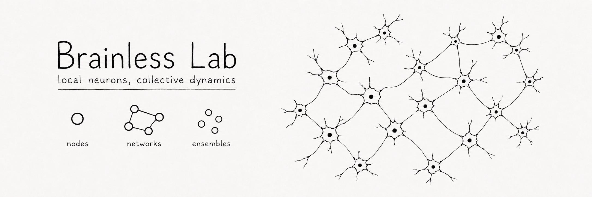

# BrainlessLab.jl

[](https://github.com/btgaskin/brainless-lab/actions/workflows/ci.yml)

An exact-input proof-cache hit can make CI green without rerunning the matching test suite.

<p align="center"></p>

BrainlessLab is a Julia platform for studying simple neural substrates in closed
sensorimotor loops. It separates runtime composition, repeated evaluation, research
operations, and portable records.

The canonical `:falandays` node is validated on declared reference trajectories. Tracking,
Pong, and Wall are the core benchmark tasks. These boundaries do not establish general
competence or biological fidelity.

## Quick start

BrainlessLab is not yet registered in Julia General.

```bash
git clone https://github.com/btgaskin/brainless-lab.git
cd brainless-lab
julia --project=. -e 'using Pkg; Pkg.instantiate()'
julia --project=. -e 'using BrainlessLab; sim = simulate(:tracking; node=:falandays, ticks=300, seed=26); println(task_outcome(sim))'
```

The public guide provides four direct paths:

1. [Run your first simulation](https://brainless-lab.pages.dev/tutorials/first-simulation/)
2. [Create a reproducible profile](https://brainless-lab.pages.dev/tutorials/reproducible-profile/)
3. [Compare conditions](https://brainless-lab.pages.dev/tutorials/compare-conditions/)
4. [Extend from another project](https://brainless-lab.pages.dev/tutorials/extend-project/)

## Repeated research

```text
NodeSpec + TaskSpec + body + InteractionCycle
  → CompositionSpec

CompositionSpec + EvaluationSpec
  → EvaluationTarget
  → operation plan
  → typed result
  → record
```

Validate and run one example plan:

```bash
julia --project=. bin/brainlesslab.jl check plans/examples/profile_tracking.toml
julia -t auto --project=. bin/brainlesslab.jl run \
  plans/examples/profile_tracking.toml --root records
```

Every operation record contains the submitted and resolved plans, realised seeds, CSV
tables, a machine-readable summary, provenance, checksums, and a readable report.
`ExperimentSpec` groups ordinary operation plans under one versioned scientific question.

Browse the [Handbook](https://brainless-lab.pages.dev/handbook/system-map/), the
[Research record guide](https://brainless-lab.pages.dev/research/), and the
[accepted-run catalogue](https://brainless-lab.pages.dev/research/catalogue/). The
catalogue retains accepted contributor records and linked maintainer replays without
turning them into additional independent results. It also marks older compatibility
records explicitly.

Browse software that remains outside the core learning path in the
[Experimental catalogue](https://brainless-lab.pages.dev/experimental/).

## Citation and attribution

The canonical `:falandays` node implements the model published in:

> Falandays, J. Benjamin; Yoshimi, Jeffrey; Warren, William H.; Spivey, Michael J.
> "A potential mechanism for Gibsonian resonance: behavioral entrainment emerges from
> local homeostasis in an unsupervised reservoir network."
> *Cognitive Neurodynamics* **18**(4), 1811–1834 (2024).
> [doi:10.1007/s11571-023-09988-2](https://doi.org/10.1007/s11571-023-09988-2)

**If you use this software, cite that work as well as BrainlessLab.**

BrainlessLab's implementation is an independent reimplementation of the published model.
The authors' own Julia source is public at
[bfalandays/ReservoirModel_followups](https://github.com/bfalandays/ReservoirModel_followups)
and is cited, not vendored: no upstream source, data, or figures are redistributed here.
Task-specific constants are recorded with per-file provenance in
[`src/api/paper_config.jl`](src/api/paper_config.jl), and the reference fixtures are
described in [`test/FIXTURES.md`](test/FIXTURES.md).

## Development

Run the small contract gate during ordinary development:

```bash
julia --project=. -e 'using Pkg; Pkg.test()'
```

Then run the applicable runtime, operations, scientific-oracle, or visual
gate described in [test/README.md](test/README.md). Build the site separately:

```bash
cd site
bun install
bun run build
```

See [CONTRIBUTING.md](CONTRIBUTING.md), [CITATION.cff](CITATION.cff), and the
[MIT licence](LICENSE).
