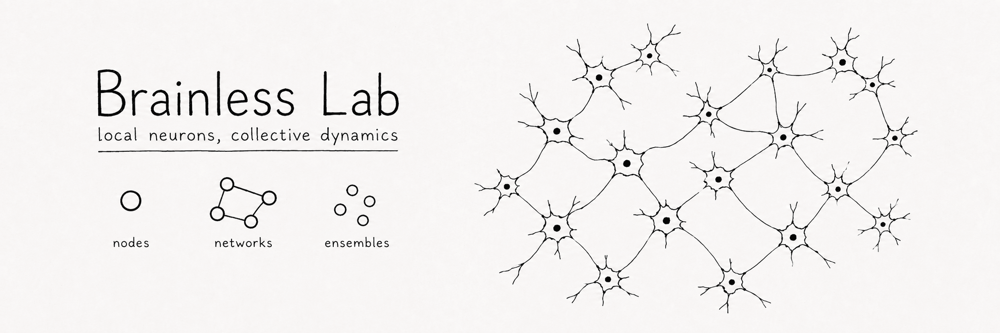

# BrainlessLab

[](https://github.com/btgaskin/brainless-lab/actions/workflows/python.yml)

<p align="center"></p>

BrainlessLab is a Python and Quadrants platform for studying locally adapting neural reservoirs in declared tasks. NumPy constructs models and analyses records. Quadrants advances the neural and world state in bounded batches.

The active models are Falandays and SORN. The active tasks are Tracking, Pong, Plank CartPole Easy, delayed cue and six experimental capacity-probe families. The probe library retains 64 difficulty cells. Software availability does not establish learning, cognition or biological fidelity.

## Start a recorded evaluation

Install [uv](https://docs.astral.sh/uv/getting-started/installation/), then use the locked Python 3.12 environment:

```bash
git clone https://github.com/btgaskin/brainless-lab.git
cd brainless-lab
uv sync --locked
uv run brainlesslab check python/plans/delayed-cue.toml
uv run brainlesslab run python/plans/delayed-cue.toml --root records
```

The check command resolves the protocol without simulation. The run command writes a portable record under a new record directory. Inspect the directory printed by the command:

```bash
uv run brainlesslab inspect records/RECORD_ID
```

Use [the first-run guide](https://brainless-lab.pages.dev/tutorials/first-simulation/) for the public Python API and record interpretation. [The platform limits](https://brainless-lab.pages.dev/platform-limits/) distinguish implemented backends from qualification receipts.

## Keep the layers separate

`NodeSpec` and `TaskSpec` describe one model and task. `CompositionSpec` adds node count and input gain. `EvaluationSpec` declares independent blocks, trials, horizon, warm-up and scientific seed partition. `EvaluationTarget` gives a condition stable identities. `Plan` names a question, evidence state and operation. `ExecutionSpec` controls backend, batch size, memory budgets and recording without changing the scientific protocol.

Task outcomes retain their key and raw value. Null-adjusted outcomes use `(raw - null_mean) / (upper_bound - null_mean)`. Negative values remain visible. Adjusted intervals independently resample model blocks and calibration trajectories. A task upper bound is not an implemented oracle.

Offline decoding uses sparse emitted-activity observations, whole-trial fit/validation/evaluation splits and fit-only scaling. Diagnostic labels never enter the online controller.

## Reproduce the implementation

```bash
uv sync --locked --group dev
uv run pytest
uv run ruff check python
uv run pyright
uv build
cd site
bun install --frozen-lockfile
bun test
bun run build
```

The CPU reference policy is strict ordered float64 arithmetic. Metal uses an explicit float32 policy and needs its own qualification. The CI matrix requests Ubuntu x64, Windows x64 and macOS arm64 CPU checks. A configured job is not a passed architecture receipt.

## Historical research

The Julia implementation is preserved in Git at [revision d0fc756d](https://github.com/btgaskin/brainless-lab/tree/d0fc756d). Its Falandays validation applies to declared reference trajectories at that implementation boundary. Python equation tests and later backend qualification are separate evidence.

Accepted contributions, experiments, benchmark protocols and historical tables retain their source revisions and evidence states. This rewrite does not rerun or promote them. Use [the public catalogue](https://brainless-lab.pages.dev/research/catalogue/) to find immutable records.

See [CONTRIBUTING.md](CONTRIBUTING.md), the project-local [BrainlessLab skill](skills/brainless-lab/SKILL.md), and [the implementation exercises](docs/python/learning.md).
