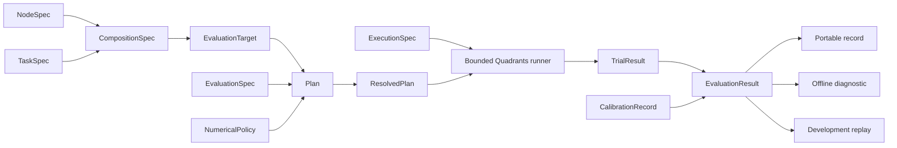

# Architecture and implementation boundaries

The rewrite keeps one scientific protocol and one device execution path. It supports
Falandays and SORN in ten declared task families. Host construction and offline analysis
use NumPy; Quadrants advances both neural state and worlds on CPU or Metal.

## Ontology

| Object | Owns | Does not own |
| --- | --- | --- |
| NodeSpec | Model kind and local adaptation parameters | Node count, task, placement |
| TaskSpec | Observations, action contract, timing and native outcome | Neural model or calibration evidence |
| CompositionSpec | Node, task, count and input gain | Repetition or backend |
| EvaluationTarget | Condition identity, pairing and mechanism streams, interventions | Physical batch slot |
| EvaluationSpec | Independent blocks, trials, horizon, warm-up, construction scope and seed bank | Device allocation |
| NumericalPolicy | Precision, strict arithmetic, reduction and RNG scheme | Hardware selection |
| Plan | Question, version, operation and evidence state | Confirmation or human acceptance |
| ResolvedPlan | Fully validated parameters, ports, timing and contract hash | Device buffers |
| ExecutionSpec | Backend, batch limit, managed-memory allowance, cache and recording budgets | Random identity |
| ModelBatch and TaskBatch | Owned device state for a homogeneous cohort | Study interpretation |
| TrialResult | Identity, status, completed ticks, frames and native outcome | Independent neuron samples |
| CalibrationRecord | Frozen task-matched chance estimate and uncertainty | Reservoir design or biological validation |
| ProbeEvent | Sparse emitted activity with stable feature IDs | Online labels or a trained controller |
| EvaluationResult | Trials, independent block summaries, paired contrasts and diagnostics | Promotion of a study |
| Record bundle | Versioned plan, resolved values, tables, source, lock and checksums | Durable device checkpoint/resume |

## Execution

The runner groups compatible population and port dimensions, task families and control
policies. Model parameters, task parameters, horizons and input gains remain runtime
arrays. Array ranks and a small set of family/precision choices determine compilation.
Ordered destination-owned recurrent sums avoid floating-point atomics.

Each world has its own tick, done flag, finite flag and horizon. A numerical failure
masks the world after the neural frame which detects it. It cannot advance or recover
on a later frame. CartPole performs 24 neural frames per world tick. Random null actions
are held through that entire cycle. Reference controllers use a fused serial tile per
world; reservoir frames retain their global neural update barriers.

Stable scientific keys determine construction, worlds, drive, controls and input
permutation. They never contain display labels or device slots. Construction scope
decides whether wiring is shared across an evaluation, a block or a single trial.
Every trial starts from complete fresh state. Bounded random tapes retain prefetched
tails and advance their logical cursors only for actual frames or ticks.

Memory admission runs before construction and device allocation. Its conservative
estimate includes dense matrices, reset copies, host staging and random tiles.
Recording has a separate preflight budget and fails rather than silently truncating.
These budgets bound managed buffers; they do not cap compiler RSS or a backend's
retained allocator pool. A sparse mask still uses dense matrix storage.

## Engineering and qualification

The package uses a locked Python 3.12 environment, immutable specifications, ordinary
modules, explicit device lifecycle and a small static boundary for the Quadrants DSL.
Pyright checks host calls and frozen bundle fields. Runtime tests check dtype, rank,
precision conversion and ownership. The stubs do not replace live kernel annotations.

Tests compare independent equations, immutable predecessor fixtures, full reset,
inactive slots, failure latching, batch partitioning, source-cache invalidation,
record integrity and offline splits. They execute regardless of cache hits. Separate
processes measure a cold cache, a warm cache with a new process and warm execution.
Compilation counts check that new shapes and scalar values do not create unintended
specialisations.

CPU64 is the reference policy. CPU32 and Metal32 require their own receipts.
Configured Windows/Linux/macOS CI jobs are prospective qualification until they run.
CUDA, ROCm and Vulkan remain unqualified and are rejected by the current public
execution policy. General autodiff, distributed execution, durable checkpoints,
heterogeneous ecological populations and a general plugin registry remain follow-on
work. Their absence keeps the current core small and reviewable.

## Relationship to Genesis engineering

The transferable work is the compiler/runtime boundary, deterministic scientific
identity, bounded batching, scalable tests, packaging, profiling, records and issue
reproduction. Per-world time and narrow model/task modules leave room for later
independent stepping and extensions. The present project does not implement robot
actuation, multi-physics solvers, scene editing, rendering or differentiable simulation.

Use [the implementation exercises](learning.md) to learn each tool through a measured
change. Start an upstream contribution from a minimal Quadrants-only reproduction,
state the observed compiler version and backend, compare the workaround, and ask the
maintainers about the intended contract. Local issue drafts are reviewable material;
they are not submitted issues or accepted upstream contributions.
